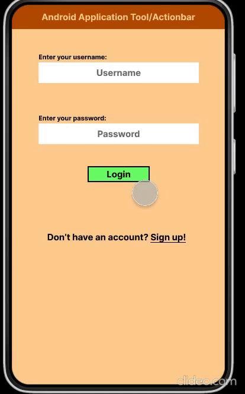

# TavernCrawler

## Table of Contents
1. [Overview](#Overview)
1. [Product Spec](#Product-Spec)
1. [Wireframes](#Wireframes)
2. [Schema](#Schema)

## Overview
### Description
TavernCrawler is an app geared towards making the boring side of planning of a bar crawl into a quick and easy endeavour! Instead of having to look up bars one by one and tediously plan out an expedition, you instead have a list of all the bars near you, complete with contact information, menus, a map, and more!

### App Evaluation
- **Category:** Travel & Local 
- **Mobile:** The app would be best designed for mobile devices, as the ability to take information with you and potentially order a ride home would require a mobile device.
- **Story:** Provides a list of local bars, and allows users to plan a route of those bars. Users can then decide to leave a review/rating of those bars.
- **Market:** Only users of legal drinking age can use this app, potentially restricting signing up without verifying age. Geared towards alcohol enthusiasts.
- **Habit:** The app would be designed to provide a convenient source of information for going out to drink, even at just one location. Users would use the app as often as they tend to go drinking.
- **Scope:** Initially, we would concentrate on making sure that the app functions in most urban cities in the USA. This app could broaden its scope eventually to include more areas, with a more comprehensive set of bars, and with closer collaboration with major bars and chains.

## Product Spec

### 1. User Stories (Required and Optional)

**Required Must-have Stories**

* Users can sign in or create account
* User can view a list of local pubs
* User can create a list or route of pubs they want to visit
* Users can rate bars
* Detail screen for bars with a menu, ratings, and contact information
* User can review bars
* User can favorite bars, and view a list of favorites

**Optional Nice-to-have Stories**

* Lyft connectivity to order a ride home to a specified location
* Show deals for local bars (if possible)
* User can blacklist bars

### 2. Screen Archetypes

* Login screen
   * Allow users to sign in to account
   * Connects to similarly designed Registration screen, which allows users to create an account
* Map screen
   * Shows local bars on a map, can select bars to view details
   * Can pin a location as home for Lyft rides
* Details screen
   * Shows details of a specific selected bar
   * Has menu, ratings, contact information
   * Option to favorite or blacklist
* Review screen
   * Screen for filling out and submitting reviews of a specific bar
* List screen
   * List of local bars and distances
   * Can select bars from list to view details or view on map
   * Alternate tabs to view list of favorites and blacklist, can remove favorites or blacklisted bars from these lists
* Nearby offers screen (optional)
   * Shows list of deals and offers for nearby bars 
   * Can select bars to go straight to detail screen or view location on map
* Settings screen
   * User can change several settings regarding the app or their account, or log out and be returned to the login screen

### 3. Navigation

**Tab Navigation** (Tab to Screen)

* Map
* Lists
* Settings

Optional:
* Nearby Offers

**Flow Navigation** (Screen to Screen)

* Login/Account creation screens
   * Leads to map or list screen upon successful login
* Map screen
   * Can switch tab to lists or settings
   * Tap on a location to switch to details
* List screen
   * Can switch tab to map or settings
   * Tap on a location to switch to details
* Settings screen
   * Can switch tab to map or lists
   * Can log out of account, returning to login screen
* Details screen
   * Can back out to previous list or map screen
   * Can enter review screen for writing reviews

## Wireframes


### [BONUS] Digital Wireframes & Mockups


### [BONUS] Interactive Prototype


## Schema 
[This section will be completed in Unit 9]
### Models
Property | Type | Description
--- | --- | ---
objectId | String | Unique identifier for the object (Default)
username | String | Username of the user
password | String | Password of the user
homeAddress | String | Home address of the user
title | String | Title of the user's review
ratingNum | Number | The rating number associated with the review
body | String | Content of the user's review
user | Pointer | User associated with the review
bar | Pointer | Bar that the user has favorited
user | Pointer | User that has favorited the bar
name | String | Name of the bar
location | String | Location of the bar (Multiple of the same bar could exist in different cities)
image | File | Image associated with the bar
### Networking
```java
	ParseQuery<Favorites> query = ParseQuery.getQuery(Favorites.class);
	query.include(currentUser);
        query.addDescendingOrder(reatedAt);
        query.findInBackground(new FindCallback<>() {
            @Override
            public void done(List<Favorites> favorites, ParseException e) {
		if(e != null) Log.e("CLASS_TAG", String.valueOf(e) + "has occurred.", e);
                for(Favorite favorite : favorites) {
                    //Display favorites
                }
                //Do more things with favorites
            }
        });
```
**Login Screen**
* (Read/GET) Login user
```java
	ParseUser.logInInBackground(etUsername.getText().toString(), etPassword.getText().toString(), new LogInCallback() {
            @Override
            public void done(ParseUser user, ParseException e) {
                if(e != null) Log.e(TAG, "Something went wrong with Parse", e);
		//Use intent to redirect user
            }
        });
```
* (Create/POST) Create new user
```java
	User user = new User();
        user.setUsername(etUsername.getText().toString());
	user.setPassword(etPassword.getText().toString());
        user.saveInBackground(new SaveCallback() {
            @Override
            public void done(ParseException e) {
                if(e != null) Log.e(TAG, "Error while saving", e);
        });
```

**Home Screen**
* (Read/GET) Query all available ratings for bars
```java
	ParseQuery<Bars> query = ParseQuery.getQuery(Bars.class);
	query.includeAll();
        query.findInBackground(new FindCallback<>() {
            @Override
            public void done(List<Bars> bars, ParseException e) {
		if(e != null) Log.e("CLASS_TAG", String.valueOf(e) + "has occurred.", e);
                for(Bars bar : bars) {
                    //Display bars
                }
            }
        });
```
* (Read/GET) Query all favorite bars of user
```java
	ParseQuery<Favorites> query = ParseQuery.getQuery(Favorites.class);
	query.include(Favorites.user);
	query.whereEqualTo(Favorites.user, ParseUser.getCurrentUser());
        query.findInBackground(new FindCallback<>() {
            @Override
            public void done(List<Favorites> favorites, ParseException e) {
		if(e != null) Log.e("CLASS_TAG", String.valueOf(e) + "has occurred.", e);
                for(Favorite favorite : favorites) {
                    //Display favorites
                }
            }
        });
```
* (Create/POST) Add bar to route
```java
	Bars bar = new Bars();
        bar.setUser(ParseUser.getCurrentUser());
	bar.setBar(new Bars()); //Bar to be added
        bar.saveInBackground(new SaveCallback() {
            @Override
            public void done(ParseException e) {
                if(e != null) {
                    Log.e(TAG, "Error while saving", e);
                    return;
                }
            }
        });
```

**Detail Screen**
* (Read/GET) Query all available reviews for bar
```java
	ParseQuery<Reviews> query = ParseQuery.getQuery(Reviews.class);
	query.whereEqualTo(Reviews.bar, getCurrentBar());
        query.findInBackground(new FindCallback<>() {
            @Override
            public void done(List<Reviews> reviews, ParseException e) {
		if(e != null) Log.e("CLASS_TAG", String.valueOf(e) + "has occurred.", e);
                for(Reviews review : reviews) {
                    //Display reviews
                }
            }
        });
```
* (Create/POST) Add bar to favorites
```java
	Favorites favorite = new Favorites();
        favorite.setUser(ParseUser.getCurrentUser());
	favorite.setBar(new Bars()); //Bar to be added
        favorite.saveInBackground(new SaveCallback() {
            @Override
            public void done(ParseException e) {
                if(e != null) {
                    Log.e(TAG, "Error while saving", e);
                    return;
                }
            }
        });
```
* (Create/POST) Add a bar to blacklist
```java
	BlacklistedBar blacklistedBar = new BlacklistedBar();
        blacklistedBar.setUser(ParseUser.getCurrentUser());
	blacklistedBar.setBar(new Bars()); //Bar to be added
        blacklistedBar.saveInBackground(new SaveCallback() {
            @Override
            public void done(ParseException e) {
                if(e != null) {
                    Log.e(TAG, "Error while saving", e);
                    return;
                }
            }
        });
```
* (Delete) Delete bar from favorites
```java
	ParseQuery<Favorites> query = ParseQuery.getQuery(Favorites.class);
	query.whereEqualTo(Favorites.user, ParseUser.getCurrentUser());
	query.whereEqualTo(Favorites.bar, getCurrentBar());
	query.findInBackground(new FindCallback<Post>() {
            @Override
            public void done(List<Favorites> favorites, ParseException e) {
                if(e != null) Log.e(TAG, "Something in this query has gone wrong", e);
                for(Favorites favorite : favorites) {
                    favorite.deleteInBackground();
                }
            }
        });
```
* (Delete) Delete a bar from blacklist
```java
	ParseQuery<BlacklistedBar> query = ParseQuery.getQuery(BlacklistedBar.class);
	query.whereEqualTo(BlacklistedBar.user, ParseUser.getCurrentUser());
	query.whereEqualTo(BlacklistedBar.bar, getCurrentBar());
	query.findInBackground(new FindCallback<Post>() {
            @Override
            public void done(List<BlacklistedBar> blacklistedBars, ParseException e) {
                if(e != null) Log.e(TAG, "Something in this query has gone wrong", e);
                for(BlacklistedBar blacklistedBar : blacklistedBars) {
                    blacklistedBar.deleteInBackground();
                }
            }
        });
```

**Review Screen**
* (Create/POST) Create review for bar
```java
	Reviews review = new Reviews();
        review.setUser(ParseUser.getCurrentUser());
	review.setBar(new Bars()); //Bar to be added
	review.setBody(etBody.getText().toString());
        review.saveInBackground(new SaveCallback() {
            @Override
            public void done(ParseException e) {
                if(e != null) Log.e(TAG, "Error while saving", e);
            }
        });
```

**Route Screen**
* (Read/GET) Query all bars in current route
```java
	ParseQuery<Bars> query = ParseQuery.getQuery(Bars.class);
	query.include(Bars.user);
	query.whereEqualTo(Bar.onRoute, true);
        query.findInBackground(new FindCallback<>() {
            @Override
            public void done(List<Bars> bars, ParseException e) {
		if(e != null) Log.e("CLASS_TAG", String.valueOf(e) + "has occurred.", e);
                for(Bars bar : bars) {
                    //Display bars
                }
            }
        });
```

**Profile Screen**
* (Read/GET) Query all available profile information
```java
	ParseQuery<User> query = ParseQuery.getQuery(User.class);
	query.include(User.user);
        query.findInBackground(new FindCallback<>() {
            @Override
            public void done(User user, ParseException e) {
		if(e != null) Log.e("CLASS_TAG", String.valueOf(e) + "has occurred.", e);
		//Display user data to profile
            }
        });
```

**Settings Screen**
* (Update/PUT) Update username, password, blacklist, and favorites
```java
	ParseQuery<User> query = ParseQuery.getQuery(User.class);
	query.whereEqualTo(User.user, ParseUser.getCurrentUser());
	query.findInBackground(new FindCallback<ParseObject>() {
	    @Override
	    public void done(List<User> users, ParseException e) {
		if(e != null) Log.e(TAG, "Something went wrong here", e);
		User user = users.get(0);
		//Put changed information into user
		user.saveInBackground();
		
	    }
	 });
```
